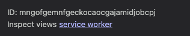
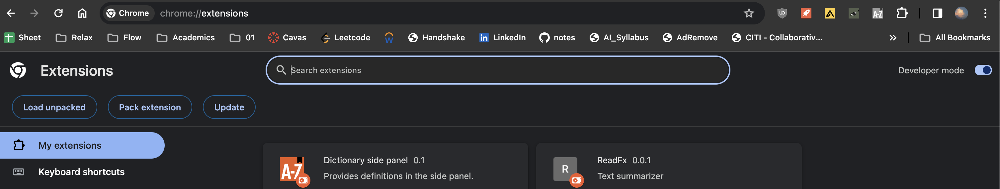
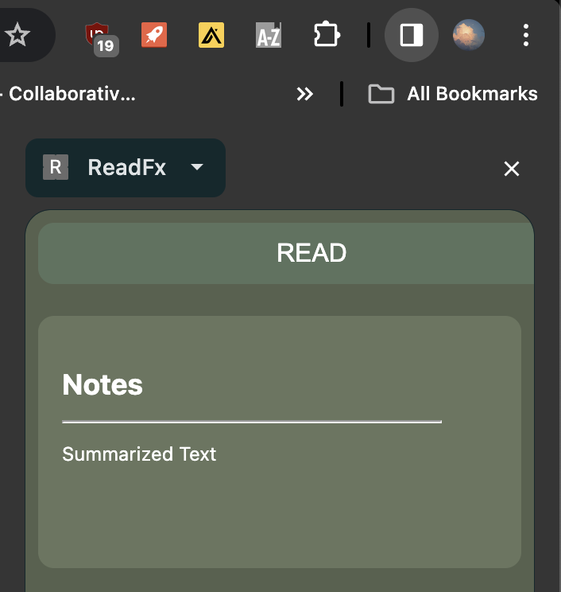
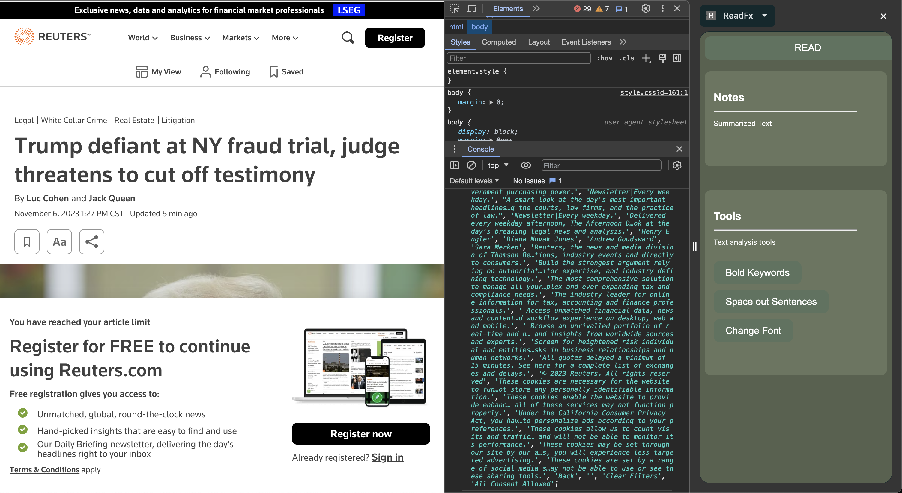

# Welcome to the ReadFX repository

The following documentation will walk you through how use/develop various parts of the chrome extension
1. Chrome extension and developer mode

2. Backend/API usage (Flask)

3. HuggingFace Models

4. Examples

## Chrome extension and developer mode
Use this console to debug the service worker








## Backend/Flask
to test django developement backend, run ```python3 manage.py runserver```. See documentation [here](https://docs.djangoproject.com/en/5.0/intro/tutorial01/)

## Large Language Models

## Examples

